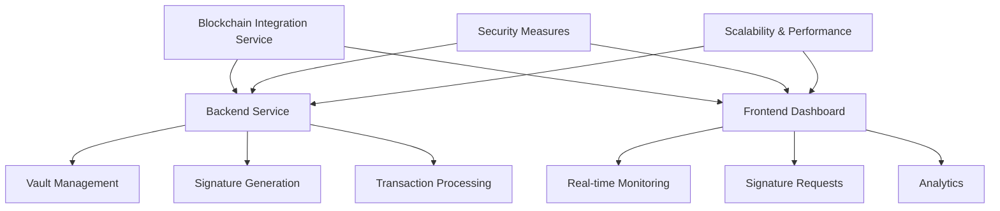
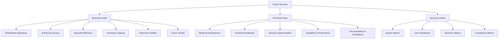
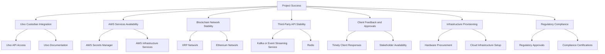
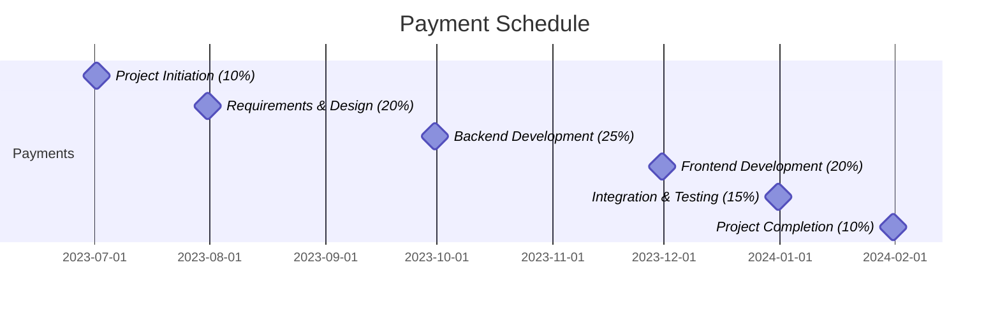
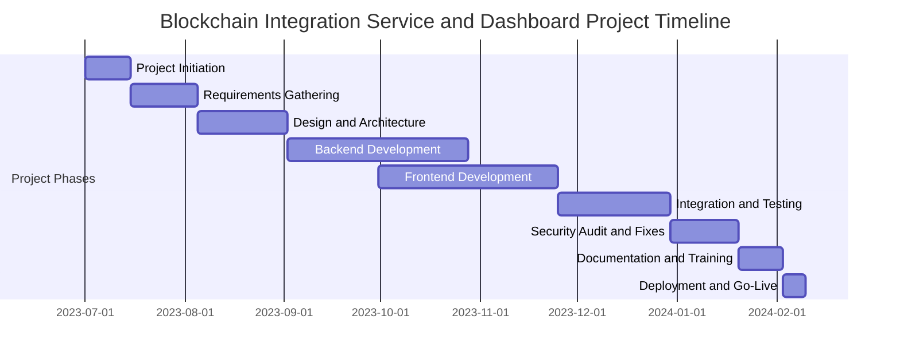
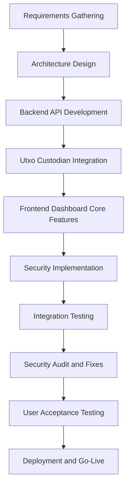
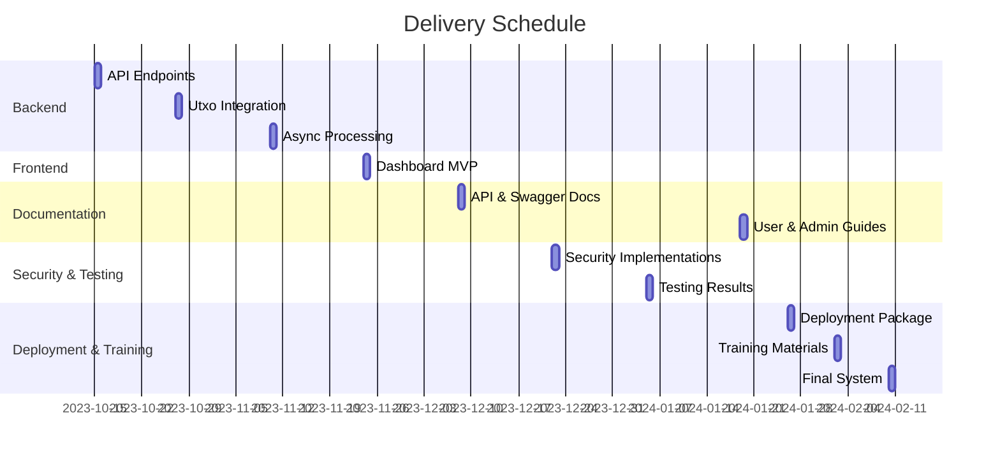

# EXECUTIVE SUMMARY

## PROJECT OVERVIEW

The Blockchain Integration Service and Dashboard project aims to develop a robust, secure, and scalable system for a cryptocurrency startup. This solution addresses the client's need for efficient management of blockchain transactions across multiple networks, specifically XRP and Ethereum, while integrating with Utxo custodian. The proposed system consists of two main components:

1. A high-performance backend service written in Golang, providing critical API endpoints for vault management, signature generation, and transaction processing.
2. A modern, responsive frontend dashboard for real-time monitoring, signature requests, and analytics.

This comprehensive solution will enable the client to streamline their blockchain operations, enhance security measures, and rapidly onboard new clients.

## OBJECTIVES

1. Develop a secure and scalable backend service that integrates with Utxo custodian and supports XRP and Ethereum blockchains.
2. Create a user-friendly frontend dashboard for efficient vault management and transaction monitoring.
3. Implement robust security measures, including encryption, authentication, and secure credential management.
4. Ensure high performance, low latency, and the ability to handle a large number of concurrent requests.
5. Provide comprehensive API documentation and Swagger docs for ease of integration and maintenance.
6. Design the system for future extensibility, including support for additional custodians and blockchain networks.

## VALUE PROPOSITION

Our agency offers unique value to this project through:

1. Expertise in blockchain technology and financial systems integration.
2. A focus on security-first development, minimizing external dependencies to reduce vulnerabilities.
3. Experience in building highly scalable and resilient systems capable of handling large transaction volumes.
4. Commitment to regulatory compliance and implementation of necessary audit trails.
5. Agile development methodology, ensuring rapid delivery and adaptability to changing requirements.
6. A holistic approach that considers both immediate needs and future scalability, providing a solution that grows with the client's business.

## PROJECT OBJECTIVES

### BUSINESS GOALS

1. Streamline blockchain operations for the cryptocurrency startup, enabling rapid onboarding of new clients.
2. Enhance security and compliance measures to build trust with clients and regulatory bodies.
3. Improve operational efficiency by automating vault management and signature processes.
4. Increase the startup's capacity to handle a larger volume of transactions across multiple blockchain networks.
5. Provide real-time visibility into transaction status and vault performance, enabling data-driven decision-making.
6. Position the startup for future growth by creating a scalable and extensible blockchain integration platform.

### TECHNICAL GOALS

1. Develop a high-performance, scalable backend service in Golang that integrates with Utxo custodian and supports XRP and Ethereum blockchains.
2. Implement secure API endpoints for vault management, signature generation, and transaction processing.
3. Create a modern, responsive frontend dashboard for real-time monitoring, signature requests, and analytics.
4. Establish robust security measures, including encryption, authentication, and secure credential management using AWS Secrets Manager.
5. Implement asynchronous processing for signature requests with Redis integration for status updates.
6. Design and implement a horizontally scalable architecture capable of handling a high volume of concurrent requests with low latency.
7. Develop comprehensive API documentation, including Swagger docs, for ease of integration and maintenance.
8. Implement fault-tolerance mechanisms and error handling throughout the system.
9. Ensure compliance with relevant financial and blockchain regulations, including necessary audit trails.

### SUCCESS CRITERIA

| Criteria | Target | Measurement Method |
|----------|--------|---------------------|
| System Uptime | 99.99% | Monitoring tools and logs |
| API Response Time | < 100ms for 95% of requests | Performance testing and monitoring |
| Concurrent Users | Support for 10,000+ simultaneous users | Load testing |
| Transaction Processing Speed | < 5 seconds for 99% of transactions | Transaction logs and monitoring |
| Security Incidents | Zero critical vulnerabilities | Regular security audits and penetration testing |
| User Satisfaction | > 90% positive feedback | User surveys and feedback collection |
| Onboarding Time for New Clients | < 24 hours | Time tracking from client signup to first transaction |
| System Scalability | Linear performance increase with added resources | Performance testing under various load conditions |
| API Documentation Completeness | 100% coverage of all endpoints and features | Documentation review and developer feedback |
| Regulatory Compliance | Full compliance with all applicable regulations | Regular compliance audits |

# SCOPE OF WORK

## IN-SCOPE

1. Backend Service Development
   - Implementation of API endpoints:
     - Get All Vaults
     - Get Raw Signature
     - Check Signature Status
     - Publish Signature
   - Integration with Utxo custodian
   - Support for XRP and Ethereum blockchains
   - Asynchronous processing for signature requests
   - Redis integration for status updates
   - AWS Secrets Manager integration for credential management
   - Comprehensive error handling and logging
   - Horizontal scalability and fault-tolerance mechanisms
   - Encryption and authentication for all communications

2. Frontend Dashboard Development
   - Display list of all vaults
   - Signature request functionality for specific vaults
   - Real-time signature request status updates
   - Analytics and monitoring features
   - Responsive web application design

3. Security Implementation
   - Minimization of external library usage
   - Secure API design and implementation
   - Implementation of authentication and authorization mechanisms
   - Encryption of sensitive data at rest and in transit

4. Documentation and Compliance
   - Comprehensive API documentation
   - Swagger docs for all endpoints
   - Implementation of audit trails for regulatory compliance
   - Documentation of security measures and best practices

5. Performance Optimization
   - High-performance backend service in Golang
   - Low-latency API responses
   - Ability to handle a large number of concurrent requests
   - Load testing and performance tuning

6. Integration and Testing
   - Integration with Utxo custodian
   - Integration with Kafka or similar event streaming service
   - Comprehensive unit and integration testing
   - User acceptance testing

## OUT-OF-SCOPE

1. Development of mobile applications
2. Integration with custodians other than Utxo
3. Support for blockchain networks beyond XRP and Ethereum
4. Custom hardware wallet integration
5. Development of smart contracts or blockchain protocols
6. User identity verification or KYC processes
7. Fiat currency integration or exchange services
8. Automated trading functionality
9. Tax reporting or financial advisory features
10. Customer support system or helpdesk integration

## ASSUMPTIONS

1. Client will provide necessary access to Utxo custodian API and documentation
2. XRP and Ethereum blockchain networks will remain stable and accessible
3. AWS services, including Secrets Manager, will be available and accessible
4. Client will provide timely feedback and approvals during development phases
5. Necessary hardware and cloud infrastructure will be provided or procured in a timely manner
6. Client has necessary licenses and permissions for all third-party services and APIs
7. Client will handle any required regulatory approvals or certifications
8. Development team has access to necessary development and testing environments
9. Client will provide sample data for testing and development purposes
10. Project stakeholders will be available for regular meetings and communications

## DEPENDENCIES

1. Utxo Custodian: Timely access to API and comprehensive documentation
2. AWS Services: Availability and reliability of AWS Secrets Manager and other required services
3. Blockchain Networks: Stability and accessibility of XRP and Ethereum networks
4. Third-Party Services: Reliability of Kafka (or chosen event streaming service) and Redis
5. Client Feedback: Timely responses and approvals from client stakeholders
6. Infrastructure: Availability of necessary hardware and cloud resources
7. Regulatory Compliance: Obtaining any required approvals or certifications
8. Development Environment: Access to necessary tools, licenses, and testing environments
9. Data Availability: Access to sample data and test accounts for development and testing
10. Team Expertise: Availability of team members with required blockchain and security expertise

# BUDGET AND COST ESTIMATES

## COST BREAKDOWN

The following table provides a detailed breakdown of the project costs:

| Category | Item | Quantity | Unit Cost | Total Cost |
|----------|------|----------|-----------|------------|
| Labor | Senior Backend Developer | 800 hours | $150/hour | $120,000 |
| Labor | Senior Frontend Developer | 600 hours | $140/hour | $84,000 |
| Labor | DevOps Engineer | 400 hours | $130/hour | $52,000 |
| Labor | Security Specialist | 200 hours | $160/hour | $32,000 |
| Labor | Project Manager | 400 hours | $120/hour | $48,000 |
| Software | AWS Services (est. 6 months) | 1 | $15,000 | $15,000 |
| Software | Development Tools and Licenses | 1 | $5,000 | $5,000 |
| Hardware | Development and Testing Servers | 4 | $2,500 | $10,000 |
| Miscellaneous | Security Audit | 1 | $20,000 | $20,000 |
| Miscellaneous | Contingency (10%) | 1 | $38,600 | $38,600 |
| **Total** | | | | **$424,600** |

## PAYMENT SCHEDULE

The proposed payment schedule is tied to project milestones and deliverables:

1. Project Initiation (10%): $42,460
   - Due upon contract signing
2. Requirements Gathering and Design Completion (20%): $84,920
   - Due upon approval of detailed project design and architecture
3. Backend Development Milestone (25%): $106,150
   - Due upon completion of core backend services and API endpoints
4. Frontend Development Milestone (20%): $84,920
   - Due upon completion of frontend dashboard MVP
5. Integration and Testing Phase (15%): $63,690
   - Due upon successful integration of all components and passing of initial testing
6. Project Completion and Deployment (10%): $42,460
   - Due upon successful deployment and client acceptance

## BUDGET CONSIDERATIONS

Several factors could potentially impact the budget, and we have strategies in place to manage these risks:

1. Scope Creep: 
   - Risk: Additional features or changes in requirements could increase development time and costs.
   - Mitigation: Strict change control process, clear documentation of scope, and regular client communication.

2. Integration Challenges:
   - Risk: Unforeseen difficulties in integrating with Utxo custodian or blockchain networks could extend development time.
   - Mitigation: Early proof-of-concept integrations, allocation of contingency budget for potential issues.

3. Security Vulnerabilities:
   - Risk: Discovery of security issues during audits could require additional development time.
   - Mitigation: Ongoing security reviews throughout development, allocation of time and budget for addressing audit findings.

4. Performance Optimization:
   - Risk: Meeting performance requirements may require additional optimization efforts.
   - Mitigation: Regular performance testing throughout development, scalability considerations in initial architecture.

5. Regulatory Compliance:
   - Risk: Changes in regulatory requirements could necessitate additional features or security measures.
   - Mitigation: Staying informed about regulatory landscape, flexible architecture to accommodate changes.

6. Third-Party Service Reliability:
   - Risk: Issues with AWS, blockchain networks, or other third-party services could cause delays.
   - Mitigation: Designing for fault tolerance, having contingency plans for service outages.

7. Talent Availability:
   - Risk: Difficulty in finding or retaining specialized blockchain developers could impact timeline and costs.
   - Mitigation: Competitive compensation, knowledge sharing within team, documentation of critical processes.

To manage these risks and uncertainties, we have included a 10% contingency in the budget. This provides a buffer for addressing unforeseen challenges without immediately impacting the overall project budget. Regular project status meetings and transparent communication with the client will ensure that any potential budget impacts are discussed and addressed promptly.

# TIMELINE AND MILESTONES

## PROJECT TIMELINE

## KEY MILESTONES

| Milestone | Description | Target Date |
|-----------|-------------|-------------|
| M1: Project Kickoff | Project initiation, team assembly, and initial planning | 2023-07-01 |
| M2: Requirements Approval | Completion of requirements gathering and client sign-off | 2023-08-04 |
| M3: Architecture Design Approval | Finalization and approval of system architecture and design | 2023-09-01 |
| M4: Backend MVP | Completion of core backend services and API endpoints | 2023-10-27 |
| M5: Frontend MVP | Completion of frontend dashboard with basic functionality | 2023-11-24 |
| M6: Integration Complete | Successful integration of backend and frontend components | 2023-12-29 |
| M7: Security Audit Clearance | Completion of security audit and implementation of necessary fixes | 2024-01-19 |
| M8: Documentation Complete | Finalization of all technical documentation and user guides | 2024-02-02 |
| M9: Go-Live | System deployment and start of production operations | 2024-02-10 |

## CRITICAL PATH

The following tasks and activities are critical to keeping the project on schedule:

1. Requirements Gathering and Approval
   - Critical for ensuring all stakeholder needs are captured before design begins

2. Architecture Design and Approval
   - Forms the foundation for all subsequent development work

3. Backend API Development
   - Essential for frontend development and integration with Utxo custodian

4. Integration with Utxo Custodian
   - Critical for core functionality of the system

5. Frontend Dashboard Core Features
   - Necessary for user interaction and system usability

6. Security Implementation
   - Crucial for protecting sensitive financial data and ensuring regulatory compliance

7. Integration Testing
   - Essential for verifying system functionality and reliability

8. Security Audit and Fixes
   - Critical for ensuring the system meets security standards before deployment

9. Final User Acceptance Testing
   - Necessary for client approval before go-live

10. Deployment and Go-Live Activities
    - Final critical steps to launch the system into production

Maintaining progress on these critical path items is essential for the timely completion of the project. Any delays in these areas should be immediately addressed and mitigated to prevent overall project delays.

# DELIVERABLES

## LIST OF DELIVERABLES

1. Backend Service
   - API Endpoints (Get All Vaults, Get Raw Signature, Check Signature Status, Publish Signature)
   - Utxo Custodian Integration
   - XRP and Ethereum Blockchain Support
   - Asynchronous Processing System
   - Redis Integration for Status Updates
   - AWS Secrets Manager Integration
   - Error Handling and Logging System
   - Horizontal Scaling and Fault-Tolerance Mechanisms

2. Frontend Dashboard
   - Vault List Display
   - Signature Request Interface
   - Real-time Status Updates
   - Analytics and Monitoring Features
   - Responsive Web Application

3. Documentation
   - API Documentation
   - Swagger Docs
   - System Architecture Documentation
   - User Manuals
   - Administrator Guides
   - Security Protocols and Best Practices

4. Security Implementations
   - Encryption Systems
   - Authentication and Authorization Mechanisms
   - Audit Trail Implementation

5. Testing Results
   - Unit Test Reports
   - Integration Test Reports
   - Performance Test Results
   - Security Audit Report

6. Deployment Package
   - Dockerized Application
   - Deployment Scripts
   - Configuration Files

7. Training Materials
   - User Training Guide
   - Administrator Training Guide
   - Video Tutorials

## DELIVERY SCHEDULE

| Deliverable | Expected Delivery Date |
|-------------|------------------------|
| Backend Service API Endpoints | 2023-10-15 |
| Utxo Custodian Integration | 2023-10-27 |
| Asynchronous Processing System | 2023-11-10 |
| Frontend Dashboard MVP | 2023-11-24 |
| API Documentation and Swagger Docs | 2023-12-08 |
| Security Implementations | 2023-12-22 |
| Testing Results | 2024-01-05 |
| User and Administrator Guides | 2024-01-19 |
| Deployment Package | 2024-01-26 |
| Training Materials | 2024-02-02 |
| Final System with All Components | 2024-02-10 |

## ACCEPTANCE CRITERIA

1. Backend Service
   - All API endpoints function as specified in the requirements
   - Successfully integrates with Utxo custodian
   - Supports XRP and Ethereum blockchain transactions
   - Processes signature requests asynchronously
   - Updates Redis with signature statuses in real-time
   - Securely manages credentials using AWS Secrets Manager
   - Handles errors gracefully and provides comprehensive logging
   - Demonstrates horizontal scalability and fault-tolerance

2. Frontend Dashboard
   - Displays list of all vaults accurately
   - Allows users to request signatures for specific vaults
   - Shows real-time updates of signature request statuses
   - Provides functional analytics and monitoring features
   - Responsive design works on desktop and mobile devices

3. Documentation
   - API documentation covers all endpoints and includes usage examples
   - Swagger docs are complete and accurately represent the API
   - System architecture documentation provides a clear overview of all components
   - User and administrator guides are comprehensive and easy to understand

4. Security Implementations
   - All communications are encrypted
   - Authentication and authorization mechanisms prevent unauthorized access
   - Audit trails capture all necessary information for regulatory compliance

5. Testing Results
   - Unit tests cover at least 80% of the codebase
   - Integration tests demonstrate successful interaction between all components
   - Performance tests show the system can handle the specified number of concurrent requests
   - Security audit report shows no critical vulnerabilities

6. Deployment Package
   - Application can be deployed using provided scripts and configurations
   - Deployed application functions correctly in the target environment

7. Training Materials
   - Cover all essential functions of the system
   - Are clear and understandable to the target audience

General Acceptance Criteria:
- All deliverables must be free of critical bugs
- Code must adhere to agreed-upon coding standards
- All features must function as specified in the requirements document
- System must meet or exceed specified performance benchmarks
- All deliverables must pass client review and approval