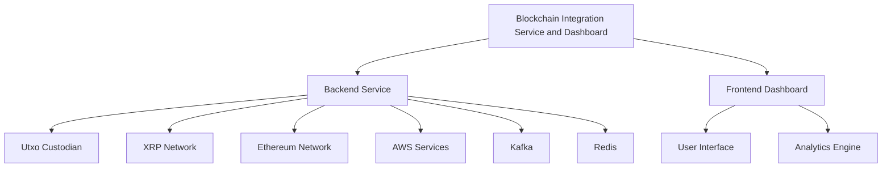
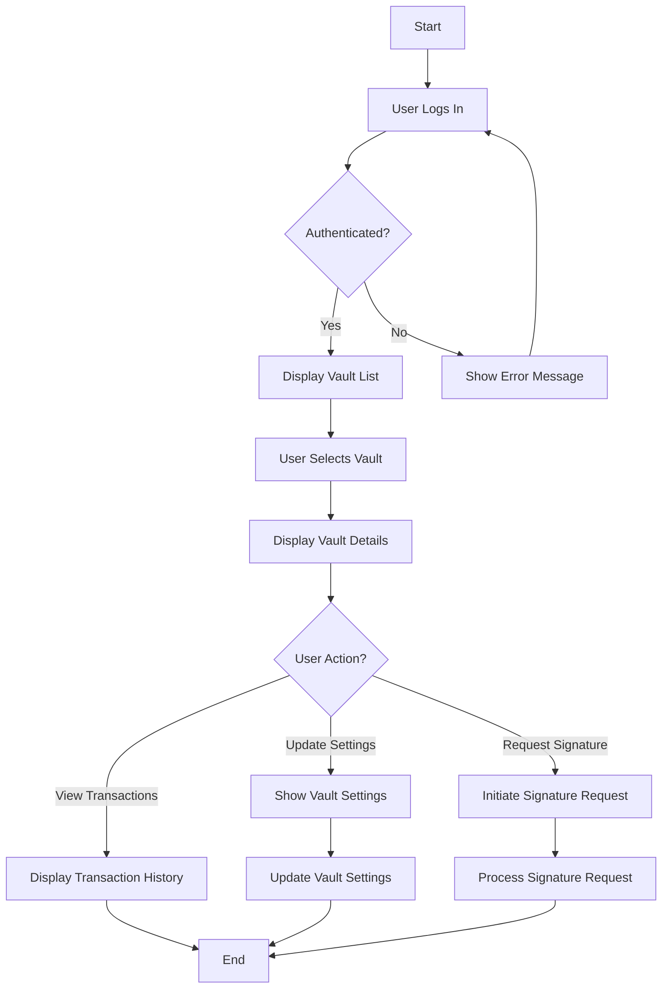
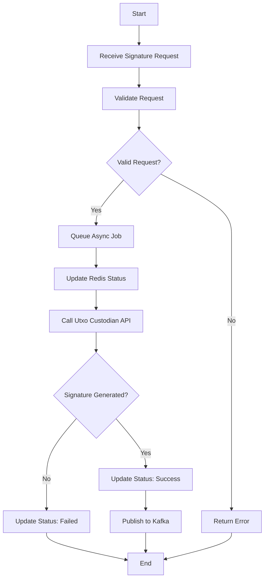
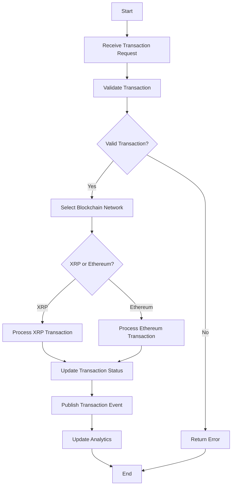
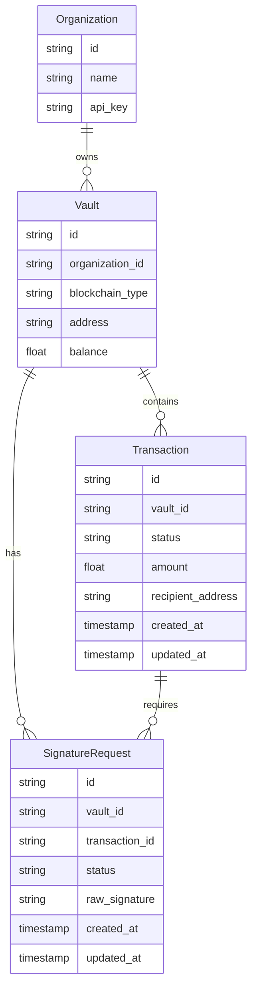
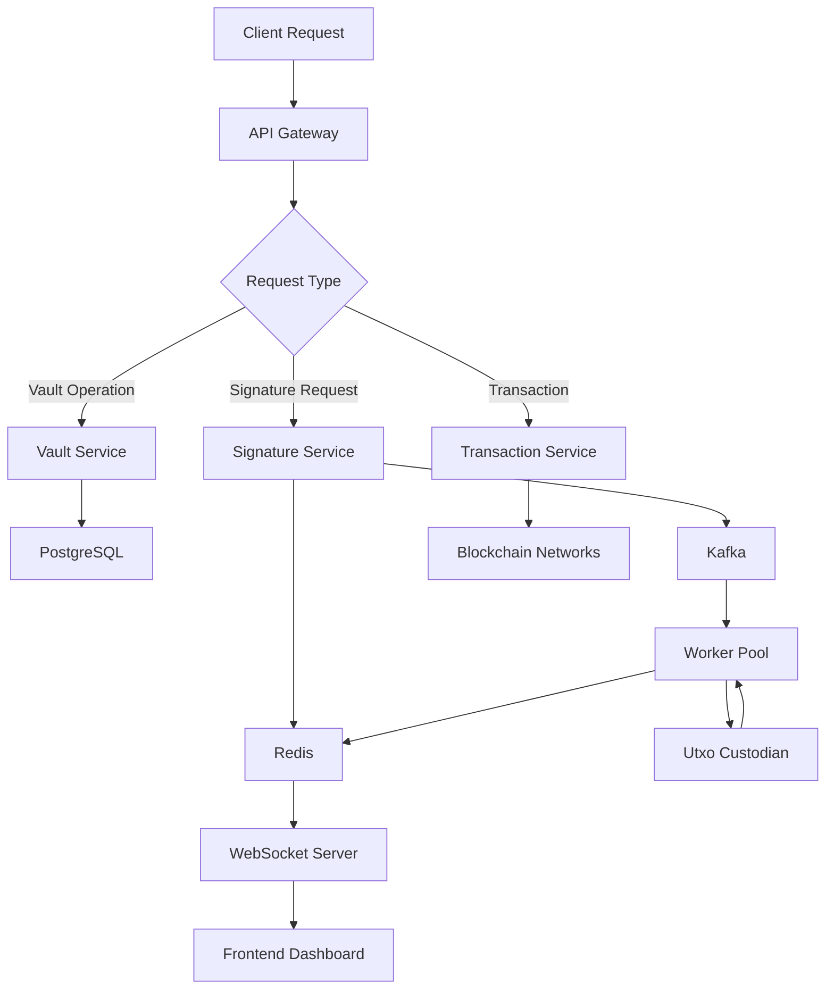

# INTRODUCTION

## PURPOSE

The purpose of this Software Requirements Specification (SRS) document is to provide a comprehensive and detailed description of the Blockchain Integration Service and Dashboard project. This document serves as a foundational reference for the development team, project stakeholders, and client representatives. It outlines the functional and non-functional requirements, system architecture, and design constraints for the proposed solution.

The intended audience for this SRS includes:

1. Development Team: To guide the implementation of the backend service and frontend dashboard.
2. Project Managers: To plan and track project progress against defined requirements.
3. Quality Assurance Team: To develop test plans and ensure the final product meets specified requirements.
4. Client Stakeholders: To review and approve the proposed solution and ensure it aligns with business needs.
5. System Administrators: To understand the deployment and maintenance requirements of the system.
6. Security Auditors: To assess the security measures and compliance aspects of the solution.

This document will serve as a contract between the development team and the client, ensuring a shared understanding of the project's objectives, scope, and deliverables.

## SCOPE

The Blockchain Integration Service and Dashboard is a comprehensive solution designed to streamline blockchain operations for a cryptocurrency startup. The system aims to provide secure, efficient, and scalable management of blockchain transactions across multiple networks, with initial support for XRP and Ethereum blockchains.

### Goals

1. Develop a high-performance backend service that integrates seamlessly with Utxo custodian.
2. Create a user-friendly frontend dashboard for real-time monitoring and management of blockchain transactions.
3. Implement robust security measures to protect sensitive financial data and ensure regulatory compliance.
4. Design a scalable and extensible system that can accommodate future growth and additional blockchain networks.

### Benefits

1. Streamlined Operations: Automate and simplify the process of managing blockchain transactions across multiple networks.
2. Enhanced Security: Implement industry-standard security measures to protect client assets and sensitive data.
3. Improved Efficiency: Reduce manual interventions and increase the speed of transaction processing.
4. Real-time Visibility: Provide instant access to transaction statuses and vault performance metrics.
5. Scalability: Support business growth with a system designed to handle increasing transaction volumes and additional blockchain networks.
6. Regulatory Compliance: Ensure adherence to financial and blockchain regulations through comprehensive audit trails and security measures.

### Core Functionalities

1. Backend Service (Golang):
   - API endpoints for vault management, signature generation, and transaction processing
   - Integration with Utxo custodian
   - Support for XRP and Ethereum blockchains
   - Asynchronous processing of signature requests
   - Real-time status updates using Redis
   - Secure credential management with AWS Secrets Manager
   - Comprehensive error handling and logging
   - Horizontal scalability and fault-tolerance mechanisms

2. Frontend Dashboard (Modern Web Application):
   - Display of all vaults associated with an organization
   - Interface for requesting signatures for specific vaults
   - Real-time updates of signature request statuses
   - Analytics and monitoring features for transaction and vault performance
   - Responsive design for desktop and mobile access

3. Security Features:
   - Encryption of all communications
   - Robust authentication and authorization mechanisms
   - Minimized use of external libraries to reduce vulnerabilities
   - Implementation of necessary audit trails for regulatory compliance

4. Integration and Scalability:
   - Integration with Kafka or similar event streaming service for signature publishing
   - Design for high performance and low latency
   - Ability to handle a large number of concurrent requests
   - Extensible architecture to support future addition of custodians and blockchain networks

By delivering these core functionalities, the Blockchain Integration Service and Dashboard will provide the cryptocurrency startup with a powerful tool to manage their blockchain operations efficiently, securely, and at scale.

# PRODUCT DESCRIPTION

## PRODUCT PERSPECTIVE

The Blockchain Integration Service and Dashboard is a comprehensive solution designed to operate within the broader ecosystem of blockchain technology and cryptocurrency management. It serves as a critical bridge between the client's cryptocurrency operations and multiple blockchain networks, initially focusing on XRP and Ethereum.

The system integrates with the following external components:

1. Utxo Custodian: The primary custodial service for managing and securing digital assets.
2. XRP and Ethereum Blockchain Networks: The underlying distributed ledger technologies for transaction processing.
3. AWS Services: Utilized for secure credential management and potentially for hosting and scaling.
4. Kafka (or similar): Event streaming service for publishing completed signatures.
5. Redis: In-memory data structure store used for real-time status updates.

The product operates as a standalone system but is designed to be extensible for future integration with additional blockchain networks, custodians, and potential microservices within the client's infrastructure.

## PRODUCT FUNCTIONS

The Blockchain Integration Service and Dashboard provides the following high-level functions:

1. Vault Management:
   - Retrieve and display a list of all vaults associated with an organization ID
   - Manage vault operations and status

2. Signature Generation and Management:
   - Request raw signatures from the Utxo custodian
   - Process signature requests asynchronously
   - Check and update signature generation status
   - Publish completed signatures to a Kafka stream or similar event streaming service

3. Transaction Processing:
   - Support transaction operations on XRP and Ethereum blockchains
   - Monitor and track transaction statuses

4. Real-time Monitoring and Analytics:
   - Display real-time updates of signature request statuses
   - Provide analytics and performance metrics for vaults and transactions

5. Security and Compliance:
   - Implement robust authentication and authorization mechanisms
   - Manage sensitive credentials securely using AWS Secrets Manager
   - Maintain audit trails for regulatory compliance

6. System Administration:
   - Manage user access and permissions
   - Configure system settings and integrations
   - Monitor system health and performance

## USER CHARACTERISTICS

The system is designed to cater to several user types with varying levels of expertise:

1. Cryptocurrency Operations Managers:
   - High level of expertise in blockchain and cryptocurrency operations
   - Responsible for overseeing vault management and transaction processing
   - Requires access to comprehensive analytics and monitoring tools

2. Financial Analysts:
   - Moderate to high level of financial expertise, with some blockchain knowledge
   - Focuses on transaction analysis and financial reporting
   - Needs access to detailed transaction data and analytics features

3. Compliance Officers:
   - Expertise in financial regulations and compliance requirements
   - Responsible for ensuring adherence to regulatory standards
   - Requires access to audit trails and compliance-related reports

4. System Administrators:
   - High level of technical expertise in IT systems and security
   - Manages system configuration, user access, and overall system health
   - Needs access to all system components and administrative tools

5. Customer Support Representatives:
   - Moderate level of knowledge about the system and blockchain basics
   - Assists users with basic inquiries and issue resolution
   - Requires access to user account information and basic system functions

User Persona Example:
Name: Sarah Chen
Role: Cryptocurrency Operations Manager
Expertise: 5+ years in blockchain technology and cryptocurrency operations
Goals: Efficiently manage vaults, optimize transaction processing, and make data-driven decisions
Needs: Real-time monitoring of vault status, quick access to transaction details, and comprehensive analytics tools

## CONSTRAINTS

1. Technical Constraints:
   - Must integrate with Utxo custodian API
   - Initial support limited to XRP and Ethereum blockchains
   - Backend service must be developed in Golang
   - Frontend must be a web-based application (no mobile app development)

2. Security Constraints:
   - All communications must be encrypted
   - Minimal use of external libraries to reduce potential vulnerabilities
   - Compliance with relevant financial and blockchain regulations

3. Performance Constraints:
   - System must handle a large number of concurrent requests
   - API response times should be under 100ms for 95% of requests
   - Must support horizontal scaling to accommodate growth

4. Regulatory Constraints:
   - Implementation of necessary audit trails for compliance
   - Adherence to data protection regulations (e.g., GDPR if applicable)

5. Budgetary Constraints:
   - Development must be completed within the allocated budget of $424,600
   - AWS service costs must be managed within the estimated $15,000 for 6 months

6. Time Constraints:
   - Project must be completed and deployed by February 10, 2024

7. Usability Constraints:
   - Interface must be intuitive for users with varying levels of technical expertise
   - Dashboard must be responsive and functional on both desktop and mobile devices

## ASSUMPTIONS AND DEPENDENCIES

Assumptions:
1. The Utxo custodian API will remain stable and backward-compatible throughout the development process.
2. XRP and Ethereum blockchain networks will maintain their current protocol structures.
3. The client has all necessary legal permissions and licenses to operate a cryptocurrency management service.
4. The development team has access to test environments that accurately represent the production environment.
5. Users of the system will have a basic understanding of blockchain and cryptocurrency concepts.
6. The client will provide timely feedback and approvals at each project milestone.

Dependencies:
1. Utxo Custodian: The system's core functionality depends on successful integration and ongoing reliability of the Utxo custodian service.
2. Blockchain Networks: The stability and availability of the XRP and Ethereum networks are critical for transaction processing.
3. AWS Services: The system relies on AWS Secrets Manager for secure credential management and potentially other AWS services for hosting and scaling.
4. Kafka (or similar): Dependency on a reliable event streaming service for publishing completed signatures.
5. Redis: The system depends on Redis for real-time status updates and caching.
6. Regulatory Environment: The project assumes current regulatory standards and may need adjustments if significant regulatory changes occur during development.
7. Third-party Libraries and Frameworks: While minimized, the system may have some dependencies on external libraries for specific functionalities.
8. Client's IT Infrastructure: The deployment and operation of the system may depend on the client's existing IT infrastructure and network capabilities.

These assumptions and dependencies will be continuously monitored throughout the project lifecycle, with contingency plans developed for any potential changes or disruptions.

# PROCESS FLOWCHART

The following process flowcharts illustrate the key workflows within the Blockchain Integration Service and Dashboard system. These diagrams provide a high-level overview of the main processes, including vault management, signature generation, and transaction processing.

## Vault Management Process

## Signature Generation Process

## Transaction Processing Flow

These process flowcharts provide a visual representation of the key workflows within the Blockchain Integration Service and Dashboard. They illustrate the logical flow of operations, decision points, and interactions between different components of the system, maintaining consistency with the previously specified technologies and frameworks.

Here's a breakdown of the product features with the requested sub-sections, maintaining consistency with the previously mentioned technologies and frameworks:

1. Vault Management

ID: F001
DESCRIPTION: Allows users to view and manage vaults associated with their organization.
PRIORITY: High

| Requirement ID | Requirement Description |
|----------------|--------------------------|
| F001-1 | Retrieve and display a list of all vaults associated with an organization ID |
| F001-2 | View detailed information for each vault |
| F001-3 | Filter and sort vaults based on various criteria (e.g., balance, activity) |
| F001-4 | Implement pagination for efficient loading of large vault lists |

2. Signature Generation

ID: F002
DESCRIPTION: Enables users to request and manage raw signatures from the Utxo custodian.
PRIORITY: Critical

| Requirement ID | Requirement Description |
|----------------|--------------------------|
| F002-1 | Request raw signatures from Utxo custodian for specific vaults |
| F002-2 | Implement asynchronous processing for signature requests |
| F002-3 | Update Redis with real-time status of signature generation |
| F002-4 | Securely manage credentials using AWS Secrets Manager |

3. Transaction Processing

ID: F003
DESCRIPTION: Facilitates the processing and monitoring of blockchain transactions on XRP and Ethereum networks.
PRIORITY: Critical

| Requirement ID | Requirement Description |
|----------------|--------------------------|
| F003-1 | Support transaction operations on XRP blockchain |
| F003-2 | Support transaction operations on Ethereum blockchain |
| F003-3 | Monitor and update transaction statuses in real-time |
| F003-4 | Implement error handling and retry mechanisms for failed transactions |

4. Real-time Monitoring Dashboard

ID: F004
DESCRIPTION: Provides a user-friendly interface for monitoring vault activities and transaction statuses.
PRIORITY: High

| Requirement ID | Requirement Description |
|----------------|--------------------------|
| F004-1 | Display real-time updates of signature request statuses |
| F004-2 | Show live transaction processing information |
| F004-3 | Implement responsive design for desktop and mobile access |
| F004-4 | Provide customizable alerts for important events or thresholds |

5. Analytics and Reporting

ID: F005
DESCRIPTION: Offers insights and generates reports on vault performance and transaction metrics.
PRIORITY: Medium

| Requirement ID | Requirement Description |
|----------------|--------------------------|
| F005-1 | Generate performance reports for individual vaults and overall system |
| F005-2 | Provide visualizations of transaction volumes and patterns |
| F005-3 | Implement customizable date ranges for analytics |
| F005-4 | Export reports in various formats (e.g., CSV, PDF) |

6. Security and Compliance

ID: F006
DESCRIPTION: Ensures the system adheres to security best practices and regulatory requirements.
PRIORITY: Critical

| Requirement ID | Requirement Description |
|----------------|--------------------------|
| F006-1 | Implement robust authentication and authorization mechanisms |
| F006-2 | Encrypt all sensitive data at rest and in transit |
| F006-3 | Maintain comprehensive audit trails for all system activities |
| F006-4 | Implement rate limiting and other security measures to prevent abuse |

7. API Integration

ID: F007
DESCRIPTION: Provides a secure and well-documented API for integration with external systems.
PRIORITY: High

| Requirement ID | Requirement Description |
|----------------|--------------------------|
| F007-1 | Develop RESTful API endpoints for all core functionalities |
| F007-2 | Implement API versioning for future compatibility |
| F007-3 | Generate comprehensive API documentation, including Swagger docs |
| F007-4 | Implement proper error handling and informative error messages |

8. Scalability and Performance

ID: F008
DESCRIPTION: Ensures the system can handle high loads and scale horizontally as needed.
PRIORITY: High

| Requirement ID | Requirement Description |
|----------------|--------------------------|
| F008-1 | Design backend services for horizontal scalability |
| F008-2 | Implement caching mechanisms using Redis for improved performance |
| F008-3 | Optimize database queries and indexes for efficient data retrieval |
| F008-4 | Implement load balancing for distributing traffic across multiple instances |

9. User Management

ID: F009
DESCRIPTION: Allows administrators to manage user accounts and permissions within the system.
PRIORITY: Medium

| Requirement ID | Requirement Description |
|----------------|--------------------------|
| F009-1 | Create, update, and deactivate user accounts |
| F009-2 | Implement role-based access control (RBAC) for different user types |
| F009-3 | Provide password reset and account recovery functionalities |
| F009-4 | Implement multi-factor authentication for enhanced security |

10. System Administration

ID: F010
DESCRIPTION: Provides tools and interfaces for system administrators to manage and monitor the platform.
PRIORITY: Medium

| Requirement ID | Requirement Description |
|----------------|--------------------------|
| F010-1 | Implement a dashboard for monitoring system health and performance |
| F010-2 | Provide tools for managing system configurations and settings |
| F010-3 | Implement logging and log analysis features for troubleshooting |
| F010-4 | Develop backup and restore functionalities for critical data |

# NON-FUNCTIONAL REQUIREMENTS

## PERFORMANCE

1. Response Time
   - API endpoints must respond within 100ms for 95% of requests under normal load conditions.
   - Real-time updates in the frontend dashboard must be delivered within 200ms of the event occurrence.

2. Throughput
   - The system must support a minimum of 1000 transactions per second across all supported blockchain networks.
   - The backend service must handle at least 10,000 concurrent API requests without degradation in performance.

3. Resource Usage
   - CPU utilization should not exceed 70% under normal operating conditions.
   - Memory usage should not exceed 80% of available RAM during peak loads.
   - Database queries should complete within 50ms for 99% of requests.

## SAFETY

1. Data Integrity
   - The system must maintain data integrity across all transactions, with zero tolerance for data corruption.
   - Implement checksums and data validation mechanisms to ensure the accuracy of stored and transmitted data.

2. Fault Tolerance
   - The system must continue to function with degraded performance in case of failure of any single component.
   - Implement automatic failover mechanisms for critical system components.

3. Disaster Recovery
   - Maintain real-time data replication to a geographically separate backup site.
   - The system must be able to recover from a complete failure within 4 hours, with a Recovery Point Objective (RPO) of 5 minutes.

4. Error Handling
   - All errors must be logged with appropriate severity levels and notifications sent for critical errors.
   - The system must gracefully degrade functionality in case of external service failures (e.g., blockchain networks, Utxo custodian).

## SECURITY

1. Authentication
   - Implement multi-factor authentication for all user accounts.
   - Use OAuth 2.0 or OpenID Connect for secure authentication flows.

2. Authorization
   - Implement role-based access control (RBAC) for all system functions.
   - Enforce the principle of least privilege for all user and service accounts.

3. Data Encryption
   - All data at rest must be encrypted using AES-256 encryption.
   - All data in transit must be encrypted using TLS 1.3 or higher.

4. Privacy
   - Implement data anonymization techniques for analytics and logging purposes.
   - Provide mechanisms for users to request deletion of their personal data in compliance with privacy regulations.

5. Security Monitoring
   - Implement real-time security monitoring and alerting for all system components.
   - Conduct regular vulnerability scans and penetration tests, at least quarterly.

## QUALITY

1. Availability
   - The system must maintain 99.99% uptime, allowing for no more than 52.56 minutes of downtime per year.
   - Implement redundancy and load balancing for all critical system components.

2. Maintainability
   - The codebase must maintain a minimum of 80% test coverage.
   - Implement comprehensive logging and monitoring to facilitate quick identification and resolution of issues.
   - Use containerization (Docker) and orchestration (Kubernetes) to simplify deployment and updates.

3. Usability
   - The user interface must be intuitive, requiring no more than 1 hour of training for basic operations.
   - The system must support internationalization and localization for at least English, Spanish, and Mandarin.
   - Implement responsive design to ensure usability across desktop, tablet, and mobile devices.

4. Scalability
   - The system must be able to scale horizontally to handle a 10x increase in load within 30 minutes.
   - Database and caching layers must support sharding and replication for improved scalability.

5. Reliability
   - The system must have a Mean Time Between Failures (MTBF) of at least 5000 hours.
   - Implement automated health checks and self-healing mechanisms for all system components.

## COMPLIANCE

1. Legal Compliance
   - The system must comply with all applicable financial regulations in the jurisdictions where it operates.
   - Implement necessary controls to comply with anti-money laundering (AML) and know-your-customer (KYC) regulations.

2. Regulatory Compliance
   - Maintain compliance with the General Data Protection Regulation (GDPR) for handling personal data of EU citizens.
   - Implement necessary controls to comply with the California Consumer Privacy Act (CCPA) for California residents.

3. Standards Compliance
   - Adhere to the Payment Card Industry Data Security Standard (PCI DSS) for handling financial data.
   - Implement security controls in alignment with the NIST Cybersecurity Framework.

4. Audit and Reporting
   - Maintain comprehensive audit logs for all system activities, retaining logs for a minimum of 7 years.
   - Generate compliance reports as required by regulatory bodies, with the ability to produce custom reports as needed.

5. Blockchain Compliance
   - Ensure compliance with the specific regulatory requirements of the XRP and Ethereum networks.
   - Implement necessary controls to comply with any future regulations specific to blockchain and cryptocurrency operations.

These non-functional requirements are designed to ensure the Blockchain Integration Service and Dashboard meets high standards of performance, safety, security, quality, and compliance. They align with the previously specified technologies and frameworks, including Golang for the backend, modern web technologies for the frontend, AWS services for infrastructure, and the use of Redis, Kafka, and containerization technologies.

# DATA REQUIREMENTS

## DATA MODELS

The Blockchain Integration Service and Dashboard will utilize the following data models to represent the core entities and their relationships:

This entity-relationship diagram illustrates the core data structures and their relationships within the system. The main entities are:

1. Organization: Represents the client company using the system.
2. Vault: Represents a blockchain wallet or account owned by an organization.
3. Transaction: Represents a blockchain transaction associated with a vault.
4. SignatureRequest: Represents a request for a signature required to authorize a transaction.

## DATA STORAGE

The Blockchain Integration Service and Dashboard will implement a robust and scalable data storage solution to ensure data integrity, availability, and performance. The following strategies will be employed:

1. Primary Database:
   - Use PostgreSQL as the primary relational database for storing structured data related to organizations, vaults, transactions, and signature requests.
   - Implement database sharding to distribute data across multiple servers for improved performance and scalability.
   - Utilize database indexing to optimize query performance for frequently accessed data.

2. Caching Layer:
   - Implement Redis as a caching layer to store frequently accessed data and reduce database load.
   - Use Redis for real-time status updates of signature requests and transaction processing.

3. Data Retention:
   - Implement a data retention policy that complies with financial regulations and blockchain best practices.
   - Store transaction data for a minimum of 7 years to meet regulatory requirements.
   - Implement an archiving strategy for older data to optimize storage costs and query performance.

4. Data Redundancy:
   - Implement database replication with at least one primary and two secondary nodes for high availability.
   - Use multi-region replication to ensure data availability in case of regional outages.

5. Backup and Recovery:
   - Perform daily full backups of the PostgreSQL database.
   - Implement continuous incremental backups to capture changes throughout the day.
   - Store backups in a separate AWS region from the primary database for disaster recovery purposes.
   - Regularly test backup restoration processes to ensure data recoverability.

6. Scalability:
   - Design the data storage architecture to support horizontal scaling by adding more database nodes as the system grows.
   - Implement database connection pooling to efficiently manage a large number of concurrent database connections.

7. Blockchain Data:
   - Store minimal blockchain data locally, primarily focusing on transaction references and statuses.
   - Utilize blockchain explorers or node services for retrieving detailed blockchain data when needed.

## DATA PROCESSING

The Blockchain Integration Service and Dashboard will implement secure and efficient data processing mechanisms to handle sensitive financial information and high-volume transaction data. The following data processing strategies will be employed:

1. Data Security:
   - Encrypt all sensitive data at rest using AES-256 encryption.
   - Implement TLS 1.3 for all data in transit.
   - Use AWS Key Management Service (KMS) for managing encryption keys.
   - Implement data masking for sensitive information in logs and non-production environments.
   - Apply the principle of least privilege for data access, utilizing role-based access control (RBAC).

2. Data Validation:
   - Implement strict input validation for all API endpoints to prevent injection attacks and ensure data integrity.
   - Validate blockchain addresses and transaction data against blockchain-specific rules before processing.

3. Asynchronous Processing:
   - Utilize a message queue (e.g., Apache Kafka) for handling asynchronous signature requests and transaction processing.
   - Implement a worker pool to process queued jobs efficiently and manage system load.

4. Real-time Updates:
   - Use Redis pub/sub mechanism for pushing real-time updates to the frontend dashboard.
   - Implement WebSocket connections for live updates of transaction statuses and signature request progress.

5. Data Aggregation and Analytics:
   - Implement batch processing jobs for generating daily, weekly, and monthly analytics reports.
   - Use time-series data structures in Redis for storing and querying real-time performance metrics.

6. Error Handling and Retry Mechanisms:
   - Implement a robust error handling system with appropriate logging.
   - Design retry mechanisms with exponential backoff for transient failures in blockchain interactions or external service calls.

7. Data Flow:

This data flow diagram illustrates the high-level process of data movement within the system:

1. Client requests are received through the API Gateway.
2. Requests are routed to appropriate microservices based on their type.
3. Vault operations interact directly with the PostgreSQL database.
4. Signature requests update Redis for real-time status and are queued in Kafka for processing.
5. Transactions interact with blockchain networks and update the database.
6. A worker pool processes queued signature requests, interacting with the Utxo Custodian.
7. Real-time updates are pushed to the frontend dashboard via WebSocket connections.

By implementing these data processing strategies and following the illustrated data flow, the Blockchain Integration Service and Dashboard will ensure secure, efficient, and scalable handling of sensitive financial data and high-volume blockchain transactions.

# EXTERNAL INTERFACES

## USER INTERFACES

The Blockchain Integration Service and Dashboard will provide a modern, responsive web-based user interface accessible through standard web browsers. The interface will be designed with a focus on usability, efficiency, and real-time information display.

Key features of the user interface include:

1. Dashboard Overview:
   - Summary of active vaults and recent transactions
   - Key performance indicators and alerts

2. Vault Management:
   - List view of all vaults with filtering and sorting options
   - Detailed view of individual vault information and transaction history

3. Signature Request Interface:
   - Form for initiating new signature requests
   - Real-time status updates of ongoing signature requests

4. Transaction Monitoring:
   - Real-time transaction status updates
   - Historical transaction data with search and filter capabilities

5. Analytics and Reporting:
   - Interactive charts and graphs for performance metrics
   - Customizable report generation

6. User Account Management:
   - User profile settings and preferences
   - Role-based access control settings

The user interface will be developed using modern web technologies such as React.js for the frontend framework, ensuring a responsive design that works seamlessly on both desktop and mobile devices.

[Placeholder for Dashboard Overview Mockup]

[Placeholder for Vault Management Interface Mockup]

[Placeholder for Signature Request Interface Mockup]

## SOFTWARE INTERFACES

The Blockchain Integration Service and Dashboard will interact with several external software systems and components:

1. Utxo Custodian API:
   - Protocol: RESTful API
   - Data Format: JSON
   - Authentication: OAuth 2.0
   - Purpose: Retrieve vault information, request signatures, and manage transactions

2. XRP Ledger API:
   - Protocol: WebSocket and RESTful API
   - Data Format: JSON
   - Authentication: API Key
   - Purpose: Interact with the XRP blockchain for transaction processing and monitoring

3. Ethereum JSON-RPC API:
   - Protocol: JSON-RPC over HTTPS
   - Data Format: JSON
   - Authentication: API Key
   - Purpose: Interact with the Ethereum blockchain for transaction processing and monitoring

4. AWS Secrets Manager:
   - Protocol: AWS SDK
   - Data Format: JSON
   - Authentication: IAM Role-based access
   - Purpose: Securely store and retrieve sensitive credentials

5. Redis:
   - Protocol: Redis protocol
   - Data Format: Key-value pairs
   - Authentication: Password-based
   - Purpose: Store real-time status updates and caching

6. Kafka:
   - Protocol: Kafka protocol
   - Data Format: Binary
   - Authentication: SASL/SCRAM
   - Purpose: Publish completed signatures and handle event streaming

7. PostgreSQL Database:
   - Protocol: PostgreSQL wire protocol
   - Data Format: Relational data
   - Authentication: Username/Password
   - Purpose: Store persistent data for the application

## COMMUNICATION INTERFACES

The Blockchain Integration Service and Dashboard will utilize various communication protocols to ensure efficient and secure data exchange:

1. HTTPS:
   - Purpose: Secure communication for all web-based interactions
   - Port: 443
   - Data Format: Encrypted HTTP traffic

2. WebSocket:
   - Purpose: Real-time updates for the frontend dashboard
   - Port: 443 (WSS)
   - Data Format: JSON messages over encrypted WebSocket connection

3. gRPC:
   - Purpose: High-performance communication between microservices (if applicable)
   - Port: Configurable (typically 50051)
   - Data Format: Protocol Buffers

4. TLS:
   - Purpose: Encryption layer for all network communications
   - Version: TLS 1.3 or higher

5. DNS:
   - Purpose: Domain name resolution for service discovery
   - Port: 53

6. NTP:
   - Purpose: Time synchronization for accurate transaction timestamps
   - Port: 123

Data Formats:
- JSON: Used for most API responses and requests
- Protocol Buffers: Used for efficient serialization in gRPC communications
- JWT (JSON Web Tokens): Used for authentication and authorization

Interaction Methods:
- RESTful API calls for most service-to-service communications
- WebSocket connections for real-time updates to the frontend
- Publish/Subscribe model using Kafka for event-driven architecture
- Database queries using prepared statements to prevent SQL injection

All communication interfaces will implement appropriate security measures, including encryption, authentication, and rate limiting to prevent abuse and ensure data integrity.

# APPENDICES

## GLOSSARY

- Blockchain: A distributed, decentralized, public ledger technology that records transactions across multiple computers.
- Custodian: An entity that holds and safeguards a client's assets.
- Vault: A secure digital storage for cryptocurrency assets.
- Smart Contract: Self-executing contracts with the terms of the agreement directly written into code.
- Gas: The fee required to conduct a transaction or execute a contract on the Ethereum blockchain.
- Consensus Mechanism: The method by which a blockchain network agrees on the validity of transactions.
- Private Key: A secret number that allows cryptocurrencies to be spent.
- Public Key: A cryptographic code that allows a user to receive cryptocurrencies into their account.
- Signature: A mathematical mechanism that proves ownership of a cryptocurrency address or wallet.
- Nonce: A number used once in cryptographic communication, often used to prevent replay attacks.

## ACRONYMS

- API: Application Programming Interface
- AWS: Amazon Web Services
- CRUD: Create, Read, Update, Delete
- DAO: Data Access Object
- DDoS: Distributed Denial of Service
- ECDSA: Elliptic Curve Digital Signature Algorithm
- GDPR: General Data Protection Regulation
- HMAC: Hash-based Message Authentication Code
- HTTPS: Hypertext Transfer Protocol Secure
- IAM: Identity and Access Management
- JSON: JavaScript Object Notation
- JWT: JSON Web Token
- KMS: Key Management Service
- KYC: Know Your Customer
- MITM: Man-in-the-Middle
- MFA: Multi-Factor Authentication
- MVP: Minimum Viable Product
- OWASP: Open Web Application Security Project
- RBAC: Role-Based Access Control
- REST: Representational State Transfer
- RPC: Remote Procedure Call
- SDK: Software Development Kit
- SLA: Service Level Agreement
- SQL: Structured Query Language
- SSL: Secure Sockets Layer
- TLS: Transport Layer Security
- TPS: Transactions Per Second
- UI: User Interface
- UX: User Experience
- XSS: Cross-Site Scripting

## ADDITIONAL REFERENCES

1. Ethereum Developer Documentation: https://ethereum.org/developers/
2. XRP Ledger Documentation: https://xrpl.org/docs.html
3. Go Programming Language Documentation: https://golang.org/doc/
4. React.js Documentation: https://reactjs.org/docs/getting-started.html
5. AWS Secrets Manager User Guide: https://docs.aws.amazon.com/secretsmanager/latest/userguide/
6. Redis Documentation: https://redis.io/documentation
7. Apache Kafka Documentation: https://kafka.apache.org/documentation/
8. Docker Documentation: https://docs.docker.com/
9. Kubernetes Documentation: https://kubernetes.io/docs/home/
10. OWASP Top Ten Project: https://owasp.org/www-project-top-ten/
11. NIST Cybersecurity Framework: https://www.nist.gov/cyberframework
12. Blockchain Security Best Practices: https://www.cisecurity.org/insights/white-papers/blockchain-security-best-practices
13. Golang Best Practices: https://golang.org/doc/effective_go
14. RESTful API Design Best Practices: https://swagger.io/resources/articles/best-practices-in-api-design/
15. Web Accessibility Guidelines (WCAG): https://www.w3.org/WAI/standards-guidelines/wcag/

These additional references provide valuable resources for the development team, covering various aspects of blockchain technology, programming languages, frameworks, security best practices, and design guidelines relevant to the Blockchain Integration Service and Dashboard project.