# INTRODUCTION

## SYSTEM OVERVIEW

The Blockchain Integration Service and Dashboard is a comprehensive solution designed to streamline blockchain operations for a cryptocurrency startup. This system provides a secure, efficient, and scalable platform for managing blockchain transactions across multiple networks, with initial support for XRP and Ethereum blockchains.

The system consists of two main components:

1. Backend Service: A high-performance server application developed in Golang.
2. Frontend Dashboard: A modern, responsive web application for user interaction and data visualization.

### Key Features

- Vault management across multiple blockchain networks
- Secure signature generation and management
- Real-time transaction processing and monitoring
- Analytics and reporting capabilities
- Integration with Utxo custodian
- Robust security measures and regulatory compliance

### System Architecture

The following diagram illustrates the high-level architecture of the Blockchain Integration Service and Dashboard:

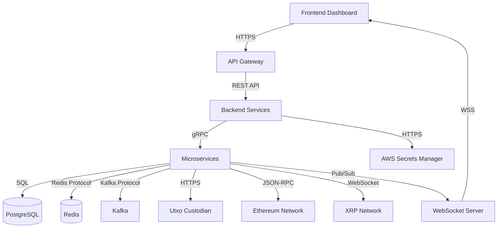

### Technology Stack

- Backend:
  - Language: Golang
  - Framework: Gin (REST API)
  - Database: PostgreSQL
  - Caching: Redis
  - Message Queue: Apache Kafka
  - Containerization: Docker
  - Orchestration: Kubernetes

- Frontend:
  - Framework: React.js
  - State Management: Redux
  - UI Components: Material-UI

- Infrastructure:
  - Cloud Provider: AWS
  - Secret Management: AWS Secrets Manager
  - Load Balancing: AWS Elastic Load Balancer

### Integration Points

1. Utxo Custodian: For secure management of digital assets
2. XRP Ledger: For XRP blockchain transactions
3. Ethereum Network: For Ethereum blockchain transactions
4. AWS Services: For infrastructure and security management

### Security Measures

- End-to-end encryption for all communications
- Multi-factor authentication for user access
- Role-based access control (RBAC)
- Regular security audits and penetration testing
- Compliance with financial regulations and data protection laws

### Scalability and Performance

- Horizontally scalable microservices architecture
- Asynchronous processing for signature requests
- Caching mechanisms for improved response times
- Load balancing for distributing traffic

This system overview provides a high-level understanding of the Blockchain Integration Service and Dashboard, its key components, technologies, and architectural design. The solution is built to be secure, scalable, and efficient, catering to the needs of a growing cryptocurrency startup while maintaining robust security measures and regulatory compliance.

# SYSTEM ARCHITECTURE

## PROGRAMMING LANGUAGES

The Blockchain Integration Service and Dashboard will utilize the following programming languages:

| Language | Purpose | Justification |
|----------|---------|---------------|
| Go (Golang) | Backend services | High performance, excellent concurrency support, strong typing, and efficient memory management. Ideal for building scalable microservices. |
| JavaScript (ES6+) | Frontend development | Widely supported, rich ecosystem of libraries and frameworks (React.js), and enables dynamic, interactive user interfaces. |
| SQL | Database queries | Standard language for relational database interactions, used with PostgreSQL. |
| Solidity | Smart contract development (if needed) | Primary language for Ethereum smart contract development, may be needed for future blockchain integrations. |

## HIGH-LEVEL ARCHITECTURE DIAGRAM

The following diagram provides an overview of the system's components and their interactions:


## COMPONENT DIAGRAMS

The following diagram details the specific components within the backend services:

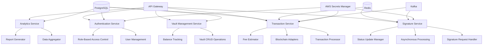

## SEQUENCE DIAGRAMS

### Signature Request Process

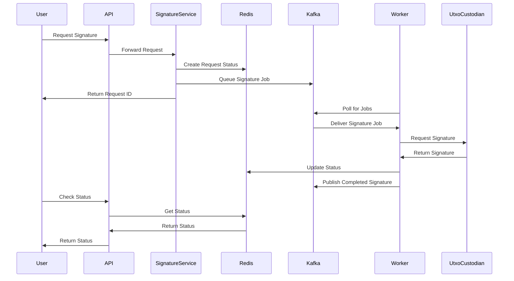

### Transaction Processing

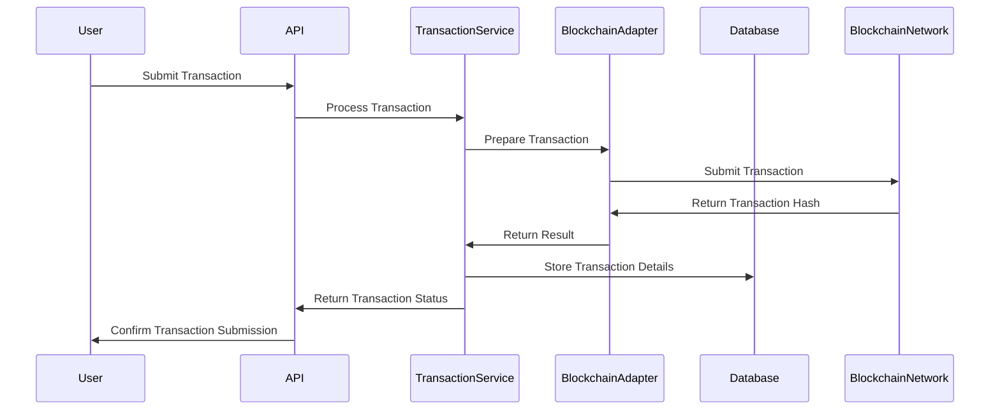

## DATA-FLOW DIAGRAM

The following diagram illustrates how information moves through the Blockchain Integration Service and Dashboard:

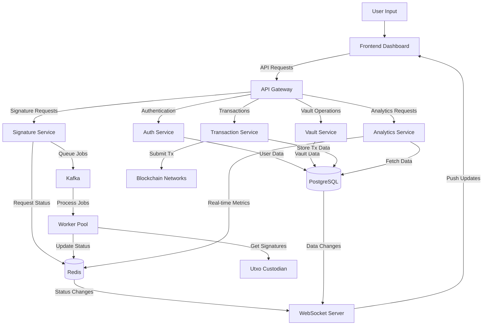

This data-flow diagram demonstrates how user inputs are processed through various services, how data is stored and retrieved from different data stores, and how real-time updates are pushed back to the frontend dashboard. It maintains consistency with the previously specified technologies and frameworks, including the use of PostgreSQL for persistent storage, Redis for caching and real-time updates, Kafka for job queuing, and WebSocket for pushing live updates to the frontend.

# SYSTEM DESIGN

## PROGRAMMING LANGUAGES

The Blockchain Integration Service and Dashboard will utilize the following programming languages:

| Language | Purpose | Justification |
|----------|---------|---------------|
| Go (Golang) | Backend services | High performance, excellent concurrency support, strong typing, and efficient memory management. Ideal for building scalable microservices. |
| JavaScript (ES6+) | Frontend development | Widely supported, rich ecosystem of libraries and frameworks (React.js), and enables dynamic, interactive user interfaces. |
| SQL | Database queries | Standard language for relational database interactions, used with PostgreSQL. |
| Solidity | Smart contract development (if needed) | Primary language for Ethereum smart contract development, may be needed for future blockchain integrations. |

## DATABASE DESIGN

The system will use PostgreSQL as the primary relational database. The database schema will be designed to support the core entities and their relationships:

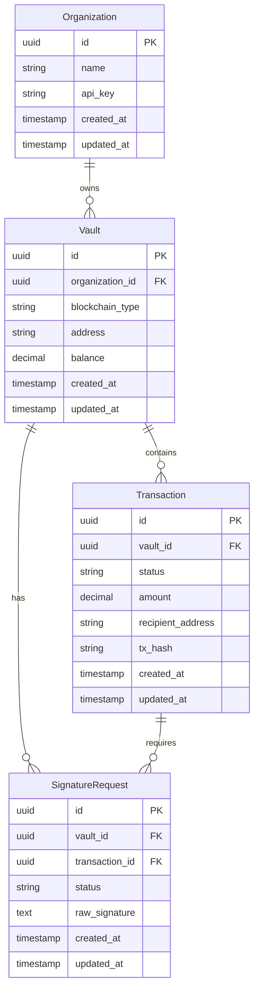

Additional considerations:
- Implement appropriate indexes on frequently queried columns.
- Use UUID for primary keys to ensure uniqueness across distributed systems.
- Implement database partitioning for `Transaction` and `SignatureRequest` tables to improve query performance on large datasets.

## API DESIGN

The system will expose a RESTful API for communication between the frontend and backend, as well as for potential integration with external systems. The API will be designed following OpenAPI (Swagger) specifications.

Key API endpoints:

1. Vault Management
```
GET    /api/v1/vaults
POST   /api/v1/vaults
GET    /api/v1/vaults/{id}
PUT    /api/v1/vaults/{id}
DELETE /api/v1/vaults/{id}
```

2. Signature Requests
```
POST   /api/v1/signature-requests
GET    /api/v1/signature-requests/{id}
GET    /api/v1/signature-requests/{id}/status
```

3. Transactions
```
POST   /api/v1/transactions
GET    /api/v1/transactions/{id}
GET    /api/v1/transactions/{id}/status
```

4. Analytics
```
GET    /api/v1/analytics/vault-performance
GET    /api/v1/analytics/transaction-volume
```

API Design Principles:
- Use versioning (e.g., `/api/v1/`) to allow for future updates without breaking existing integrations.
- Implement proper error handling with standardized error responses.
- Use JWT for authentication and implement rate limiting to prevent abuse.
- Follow RESTful naming conventions and use appropriate HTTP methods.

## USER INTERFACE DESIGN

The frontend dashboard will be developed using React.js with Material-UI components for a consistent and modern look. The user interface will be designed with a focus on usability and real-time data presentation.

Key components of the user interface:

1. Dashboard Overview
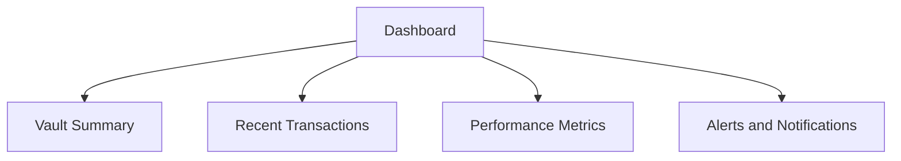

2. Vault Management Interface
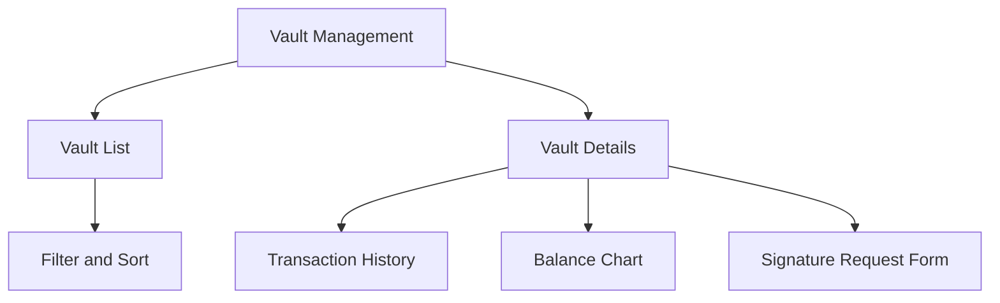

3. Transaction Monitoring
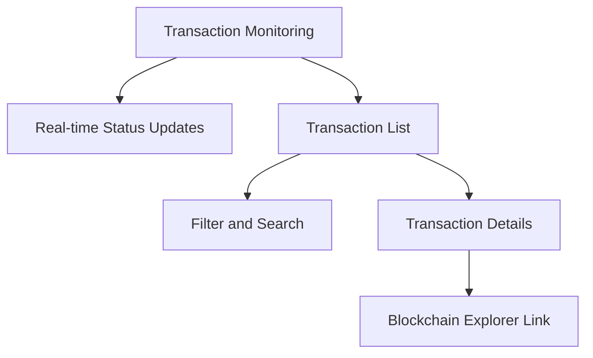

4. Analytics and Reporting
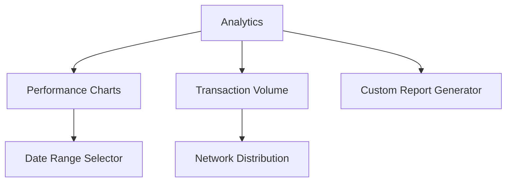

UI Design Principles:
- Implement a responsive design that works well on both desktop and mobile devices.
- Use a consistent color scheme and typography throughout the application.
- Provide clear navigation and intuitive user flows.
- Implement real-time updates using WebSocket connections for live data.
- Design with accessibility in mind, following WCAG 2.1 guidelines.

The user interface will be designed to provide a seamless and efficient experience for managing blockchain operations, monitoring transactions, and analyzing performance metrics. The use of React.js and Material-UI will ensure a modern, responsive, and consistent look and feel across the application.

# TECHNOLOGY STACK

## PROGRAMMING LANGUAGES

The following programming languages will be used in the development of the Blockchain Integration Service and Dashboard:

| Language | Purpose | Justification |
|----------|---------|---------------|
| Go (Golang) | Backend services | High performance, excellent concurrency support, strong typing, and efficient memory management. Ideal for building scalable microservices. |
| JavaScript (ES6+) | Frontend development | Widely supported, rich ecosystem of libraries and frameworks (React.js), and enables dynamic, interactive user interfaces. |
| SQL | Database queries | Standard language for relational database interactions, used with PostgreSQL. |
| Solidity | Smart contract development (if needed) | Primary language for Ethereum smart contract development, may be needed for future blockchain integrations. |

## FRAMEWORKS AND LIBRARIES

The project will utilize the following frameworks and libraries:

### Backend

| Framework/Library | Purpose |
|-------------------|---------|
| Gin | HTTP web framework for Go, providing a fast and lightweight router with excellent performance. |
| GORM | ORM library for Go, simplifying database operations and providing an abstraction layer. |
| go-ethereum | Ethereum client implementation in Go, used for interacting with the Ethereum blockchain. |
| xrpl-go | XRP Ledger client library for Go, facilitating interactions with the XRP blockchain. |
| go-redis | Redis client for Go, used for caching and real-time data storage. |
| sarama | Kafka client library for Go, enabling event streaming and asynchronous processing. |

### Frontend

| Framework/Library | Purpose |
|-------------------|---------|
| React.js | JavaScript library for building user interfaces, providing a component-based architecture. |
| Redux | State management library for JavaScript apps, ensuring predictable state updates. |
| Material-UI | React UI framework implementing Google's Material Design, providing pre-built components. |
| Chart.js | JavaScript charting library for creating interactive and responsive charts. |
| Axios | Promise-based HTTP client for making API requests from the browser. |

## DATABASES

The system will employ the following databases:

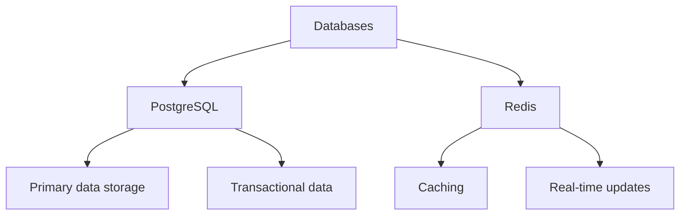

1. PostgreSQL:
   - Purpose: Primary relational database for storing structured data (organizations, vaults, transactions, etc.)
   - Justification: ACID compliant, supports complex queries, and offers excellent performance and scalability.

2. Redis:
   - Purpose: In-memory data structure store for caching and real-time data
   - Justification: High performance, support for various data structures, and pub/sub capabilities for real-time updates.

## THIRD-PARTY SERVICES

The following external services and APIs will be integrated into the system:

1. Utxo Custodian API:
   - Purpose: Secure management of digital assets and signature generation
   - Integration: RESTful API calls with OAuth 2.0 authentication

2. XRP Ledger API:
   - Purpose: Interaction with the XRP blockchain for transaction processing and monitoring
   - Integration: WebSocket and RESTful API calls

3. Ethereum JSON-RPC API:
   - Purpose: Interaction with the Ethereum blockchain for transaction processing and monitoring
   - Integration: JSON-RPC over HTTPS

4. AWS Services:
   - AWS Secrets Manager: Secure storage and retrieval of sensitive credentials
   - AWS Key Management Service (KMS): Management of encryption keys
   - AWS Elastic Load Balancer: Load balancing for high availability and scalability

5. Kafka:
   - Purpose: Event streaming and asynchronous processing
   - Integration: Kafka protocol using the sarama Go client library

6. Blockchain Explorers:
   - Etherscan API: For additional Ethereum blockchain data and analytics
   - XRP Ledger Explorer API: For additional XRP blockchain data and analytics

7. Monitoring and Logging Services:
   - Prometheus: For metrics collection and monitoring
   - Grafana: For visualization of metrics and creation of dashboards
   - ELK Stack (Elasticsearch, Logstash, Kibana): For centralized logging and log analysis

This technology stack has been carefully selected to provide a robust, scalable, and secure foundation for the Blockchain Integration Service and Dashboard. It leverages industry-standard technologies and frameworks that align with the project's requirements for high performance, real-time processing, and blockchain integration.

# SECURITY CONSIDERATIONS

## AUTHENTICATION AND AUTHORIZATION

The Blockchain Integration Service and Dashboard will implement a robust authentication and authorization system to ensure secure access to the platform and its resources.

### Authentication

1. Multi-Factor Authentication (MFA):
   - Implement mandatory MFA for all user accounts.
   - Support Time-based One-Time Password (TOTP) and SMS-based authentication methods.

2. OAuth 2.0 and OpenID Connect:
   - Utilize OAuth 2.0 for secure delegation of access.
   - Implement OpenID Connect for federated authentication.

3. JSON Web Tokens (JWT):
   - Use JWTs for secure transmission of authentication claims.
   - Implement short-lived access tokens and longer-lived refresh tokens.

4. Password Policies:
   - Enforce strong password requirements (minimum length, complexity, etc.).
   - Implement password hashing using bcrypt with appropriate work factors.

### Authorization

1. Role-Based Access Control (RBAC):
   - Implement fine-grained RBAC to control access to system resources.
   - Define roles such as Admin, Manager, Analyst, and Read-Only User.

2. Attribute-Based Access Control (ABAC):
   - Supplement RBAC with ABAC for more dynamic access control decisions.
   - Consider attributes such as user location, time of access, and security clearance.

3. Principle of Least Privilege:
   - Grant users the minimum level of access required to perform their tasks.
   - Regularly review and audit user permissions.

4. API Authorization:
   - Implement OAuth 2.0 scopes for API access control.
   - Use API keys with rate limiting for external integrations.

### Authentication and Authorization Flow

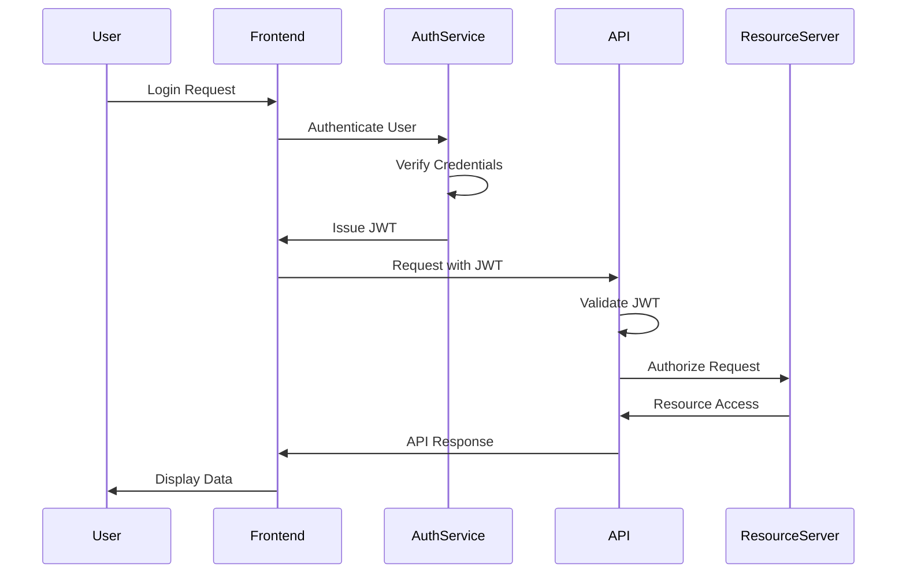

## DATA SECURITY

Protecting sensitive information is crucial for the Blockchain Integration Service and Dashboard. The following measures will be implemented to ensure data security:

1. Encryption at Rest:
   - Use AES-256 encryption for all sensitive data stored in the database.
   - Implement transparent data encryption (TDE) for PostgreSQL.

2. Encryption in Transit:
   - Enforce TLS 1.3 for all network communications.
   - Implement HTTP Strict Transport Security (HSTS) for the web application.

3. Key Management:
   - Utilize AWS Key Management Service (KMS) for secure key storage and rotation.
   - Implement a key hierarchy with master keys and data encryption keys.

4. Data Masking and Anonymization:
   - Apply data masking techniques for sensitive information in non-production environments.
   - Implement data anonymization for analytics and reporting purposes.

5. Secure Backup and Recovery:
   - Encrypt all backup data using AES-256 encryption.
   - Store backups in a separate AWS region with restricted access.

6. Data Loss Prevention (DLP):
   - Implement DLP policies to prevent unauthorized data exfiltration.
   - Use AWS Macie for automatic discovery and protection of sensitive data.

7. Secure Data Deletion:
   - Implement secure data wiping procedures for decommissioned hardware.
   - Use crypto-shredding techniques for secure deletion of encrypted data.

### Data Security Layers

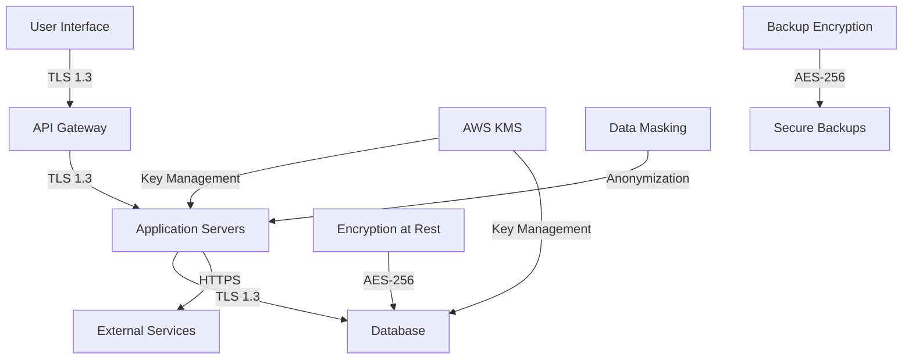

## SECURITY PROTOCOLS

The following security protocols and standards will be implemented to maintain the overall security of the Blockchain Integration Service and Dashboard:

1. Secure Development Lifecycle (SDL):
   - Implement security checks at each stage of the development process.
   - Conduct regular security training for development team members.

2. Vulnerability Management:
   - Perform regular vulnerability scans using tools like Nessus or Qualys.
   - Implement a responsible disclosure program for external security researchers.

3. Penetration Testing:
   - Conduct annual third-party penetration tests.
   - Perform continuous internal security assessments.

4. Incident Response Plan:
   - Develop and maintain a comprehensive incident response plan.
   - Conduct regular tabletop exercises to test the incident response process.

5. Security Monitoring and Logging:
   - Implement centralized log management using the ELK stack (Elasticsearch, Logstash, Kibana).
   - Set up real-time security event monitoring and alerting.

6. Compliance and Auditing:
   - Ensure compliance with relevant standards (e.g., PCI DSS, GDPR, CCPA).
   - Conduct regular security audits and maintain audit trails.

7. Network Security:
   - Implement network segmentation and microsegmentation.
   - Use Web Application Firewall (WAF) and DDoS protection services.

8. Container and Orchestration Security:
   - Implement security best practices for Docker containers.
   - Use Kubernetes security features such as Pod Security Policies and Network Policies.

9. API Security:
   - Implement API gateway security features (authentication, rate limiting, etc.).
   - Use OWASP API Security Top 10 as a guideline for securing APIs.

10. Secure Configuration Management:
    - Implement infrastructure as code (IaC) using tools like Terraform.
    - Use AWS Config for continuous monitoring of AWS resource configurations.

### Security Monitoring Architecture

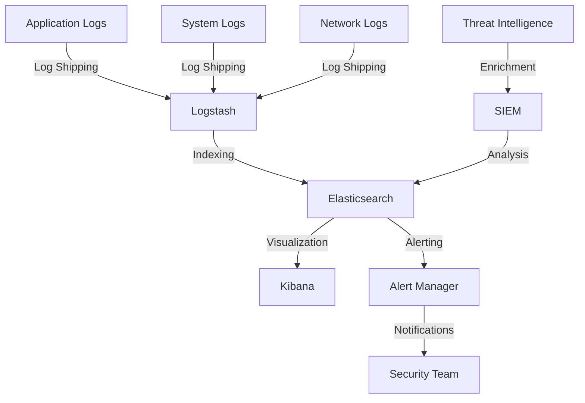

This security architecture ensures comprehensive monitoring and analysis of security events across the entire system, enabling quick detection and response to potential security incidents.

By implementing these security considerations, the Blockchain Integration Service and Dashboard will maintain a strong security posture, protecting sensitive data and ensuring the integrity of blockchain operations.